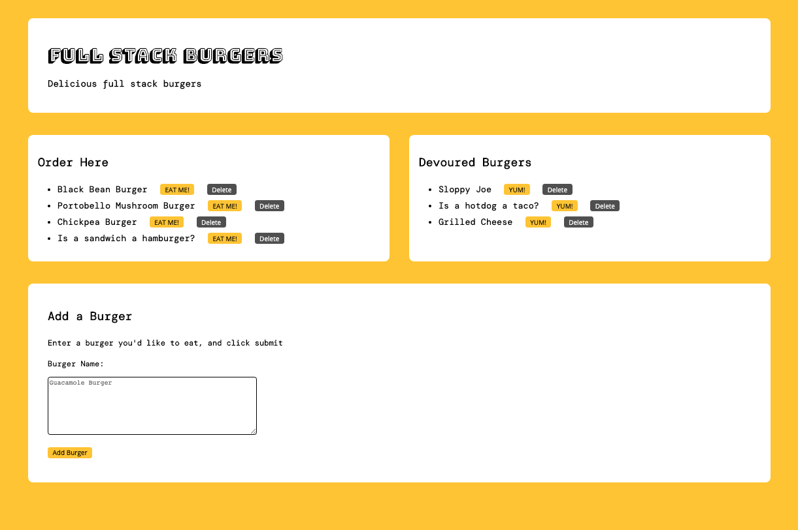

# Burger Stack: Node Express & Handlebars

## A Full-Stack App

This full-stack web application is a restaurant app that utilizes:

* MySQL
* NodeJS
* Express
* Handlebars.js, &
* A DIY Object-Relational-Mapper / ORM

This full-stack app follows an MVC design paradigm, using Node and MySQL to query and route data in the app, and Handlebars to dynamically generate HTML.

The live site is deployed to Heroku from this GitHub repo with a MySQL JAWSDB database server. 

The live site can be viewed here: https://burgerstack.herokuapp.com/



## Functionality

Burger Stack is a restaurant app that lets users input the names of burgers they'd like to eat. Whenever a user submits a burger's name, the app displays the burger on the left side of the page -- waiting to be devoured. Each burger in the waiting area has a `Eat Me!` button. When the user clicks it, the burger will move to the right side of the page.

The app stores every burger in a MySQL database that is persisted, along with their devoured status.

## Model-View-Controller / MVC Paradigm

Burger Stack is a modular application that utilizes the MVC architectural pattern to structure the codebase into distinct separation of concerns. 

The Model data layer of the application utilizes MySQL to create a persistent database and an Object Relational Mapper (ORM) to retrieve data from the database.

The HTML is dynamically generated using the Handlebars.js template engine, separating the concern of client-side rendering from other aspects of the application for the View layer in the MVC framework.

And finally, Express.js is used as Controllers to handle inputs from the user, to interact with the Model for CRUD operations, and to return query results to the View, separating client-side from server-side routes. 

### Directory structure

The application repository is composed of the following directory structure which reflects the MVC design paradigm.

```
.
├── config
│   ├── connection.js       // MySQL database connection
│   └── orm.js              // DIY object-relational-mapper to query MySQL db
│ 
├── controllers
│   └── burgers_controller.js    // Express routes
│
├── db
│   └── db.sql             // MySQL db schema and seeds
│
├── models
│   └── burger_model.js    // Data model for burgers
│ 
├── package.json           // NodeJS app metdata
│
├── public                 // Site assets and client-side logic
│   └── assets
│       ├── css
│       │   └── burger_style.css
│       └── js
│           └── burger_page.js
│
├── views                  // Handlebars templates
│   └── layouts
│       ├── main.handlebars
│   └── partials
│       │   └── burgers
│       │         └── burger-block.handlebars
|   └── index.handlebars
|
├── server.js             // Express server
```